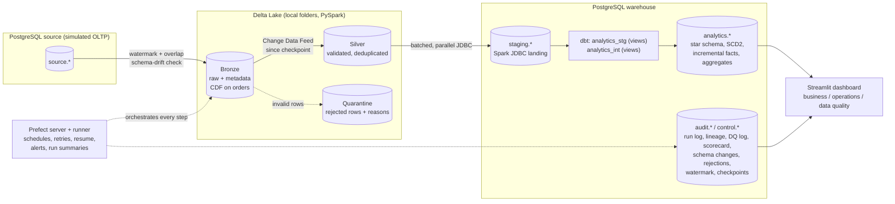

# End-to-End E-Commerce Data Pipeline

[](https://github.com/barathbalajizen/data-engineering-project/actions/workflows/ci.yml)


A batch data platform for an online store, built end to end. It **extracts** orders incrementally from an operational Postgres database, **cleans** them in a Delta Lake (Bronze → Silver), **models** a star schema with history tracking in dbt (Gold), **checks** data quality, and is **orchestrated, scheduled and monitored** with Prefect. A Streamlit dashboard shows the results. Everything runs locally with one Docker command and costs nothing.

- **Live dashboard:** _add your Streamlit Community Cloud link here_
- **Sample output (no setup needed):** [docs/sample_output/](docs/sample_output/README.md)

---

## Highlights

- **Incremental loading:** a watermark with an overlap window, Delta Change Data Feed into Silver, and incremental dbt facts. Each layer processes only what changed, and late-arriving records are still picked up.
- **Idempotent at every layer:** Delta `MERGE`, checkpoints that move only after a successful write, and delete+insert facts. Reruns, retries and backfills never create duplicates.
- **Schema drift handling:** new source columns evolve Bronze, Silver and staging. Removed columns and type changes stop the load and are recorded.
- **Data quality:** named validation rules with a quarantine that lists every failed rule; 70 dbt tests; reconciliation per key and version and of business metrics; and a **scorecard** for every run.
- **Star schema + SCD Type 2** in dbt, with staging and intermediate layers and tested business aggregates (AOV, cohort retention, product sales).
- **Orchestration and recovery with Prefect:** schedules, retries, alerts, **partial reruns and resume-from-failure** found in the audit log, and chunked backfills.
- **Audit and lineage:** every run, task attempt and table load is logged with row counts, durations, retries and errors. Source → target lineage includes Delta versions, and checkpoint history is written by a database trigger.
- **Measured performance tuning:** benchmarks at 1x and 10x, including a dbt incremental model that went from not finishing in 17 min to 3.3 s ([docs/performance.md](docs/performance.md)).
- **Dashboard** for business KPIs, pipeline operations and data quality.
- **DevOps:** dev/prod configurations with no hardcoded credentials; CI with lint, unit tests, SQL validation on Postgres, image builds and an end-to-end run; 128 pytest tests.

---

## Architecture



Details: [docs/architecture.md](docs/architecture.md) (layers, audit tables, deployments, design decisions, scaling path).

| Document | Contents |
|---|---|
| [docs/architecture.md](docs/architecture.md) | Architecture, data model, audit and lineage tables, design decisions and trade-offs |
| [docs/deployment.md](docs/deployment.md) | Setup, configuration reference, dev vs prod, production checklist, CI |
| [docs/performance.md](docs/performance.md) | Measured benchmarks and tuning decisions |
| [docs/implementation_status.md](docs/implementation_status.md) | Every requirement, where it is implemented, how it was verified, and known limitations |
| [docs/sample_output/](docs/sample_output/README.md) | Exported results of a real run |

---

## Tech stack

| Area | Tools |
|---|---|
| Processing | PySpark 3.5 (local mode), Delta Lake 3.2 |
| Storage / warehouse | PostgreSQL 15 |
| Transformation & modelling | dbt-core 1.8 (dbt-postgres) |
| Orchestration | Prefect 3 |
| Dashboard | Streamlit |
| Testing & CI | pytest (128 tests), dbt tests (70), ruff, GitHub Actions |
| Infrastructure | Docker, Docker Compose (dev and prod configurations) |

---

## What I built: the pipeline step by step

### 1. Source system
[`generate_sample_data.py`](src/generate_sample_data.py) creates realistic e-commerce data (customers, orders, items, payments, products, sellers) in the format of the public [Olist dataset](https://www.kaggle.com/datasets/olistbr/brazilian-ecommerce). [`load_source.py`](src/load_source.py) loads it into a Postgres `source` schema that acts as the company's operational database. [`simulate_changes.py`](src/simulate_changes.py) simulates a day of activity (orders delivered, customers moving city, new orders) to show incremental loading and history tracking.

### 2. Bronze: incremental extraction
[`extract_bronze.py`](src/extract_bronze.py) reads only orders changed since the last run, using a **watermark** stored in `control.watermark`. Each run re-reads a 10-minute **overlap** to catch late-committed rows. Data is written to Delta Lake with an **insert-if-not-exists MERGE** on `(order_id, updated_at)`, so a rerun never inserts a row twice. The watermark moves forward only after a successful write.

Every Bronze row carries `ingestion_ts`, `batch_id` (unique per table per run), `source_system`, `pipeline_run_id` and `source_table`. Each table load is recorded in `audit.pipeline_run_log` (rows read/inserted, duration, status, retries) and `audit.lineage` (source → target, with the Delta version written).

#### Schema drift
Before writing, [`schema_drift.py`](src/schema_drift.py) compares the source schema with the schema already accepted in Bronze:

| Change | Action |
|---|---|
| New column | Accepted: Bronze, Silver and staging evolve (older rows get `NULL`) |
| Narrower type (e.g. `int` into a `bigint` column) | Accepted: cast to the existing type |
| Removed column | Rejected: the table fails, Bronze is not written. Set `SCHEMA_DRIFT_ALLOW_REMOVED_COLUMNS=true` to fill it with `NULL` instead |
| Any other type change | Rejected |

Every change and its action is recorded in `audit.schema_changes`. To accept a rejected change on purpose, change the Bronze table explicitly (for example rewrite it with the new schema) and rerun. Without this check, Delta MERGE would silently drop new source columns.

#### Time travel and Change Data Feed
Bronze tables keep 30 days of history (`BRONZE_LOG_RETENTION`). `bronze/orders` has **Change Data Feed** enabled, so downstream steps can read only the rows that changed. The `ecommerce-delta-inspect/ops-delta-time-travel-inspect` deployment (read-only) shows a table's `history`, compares an old version with today (`as-of`), or lists the `changes` between versions.

### 3. Silver: cleaning and validation
[`transform_silver.py`](src/transform_silver.py) trims strings, validates every row, deduplicates, and loads Silver idempotently.

- **Validation rules** ([`validation.py`](src/validation.py)): primary keys and required columns not null, accepted values (order status, payment type), data types (`try_cast`), and business rules (price > 0, delivered after purchase, ...). **Invalid rows go to a quarantine table listing every rule they failed** (`failed_rules`, `reason`) instead of being dropped. Rows are validated *before* deduplication, so a bad newer version never hides the last good one.
- **Incremental orders**: Silver reads only the Bronze commits since its last checkpoint (`control.silver_checkpoint`) through **Delta Change Data Feed**. When Bronze has nothing new, the table is skipped without rewriting anything. When there is no checkpoint, or change data is missing (retention), it does a full pass. `--full-refresh` / `SILVER_FULL_REFRESH=true` forces one.
- **MERGE rules**: new keys are inserted and strictly newer versions update. **Late-arriving older versions are ignored**, so they never overwrite newer data. An invalid newer version leaves the last valid one in place and is reported as `superseded_by_invalid`. The checkpoint moves only after Silver and the quarantine are both written, so a crash in between just reprocesses the same range.
- **Reconciliation** ([`checks.py`](src/checks.py)) works per key and version: every source order must be in Silver or the quarantine, and a Silver version older than the source must be explained by a rejected newer version.

### 4. Load to the warehouse
[`load_warehouse.py`](src/load_warehouse.py) loads Silver into Postgres `staging` with Spark JDBC (truncate and reload, so it is safe to rerun).

### 5. Gold: dimensional model with dbt
The [dbt project](dbt_project/) has three layers:

| Layer | Schema | Materialization | Models |
|---|---|---|---|
| Staging | `analytics_stg` | views | `stg_orders`, `stg_customers`, `stg_products`, `stg_sellers`, `stg_order_items`, `stg_order_payments`: light renaming of the Spark-loaded `staging` tables |
| Intermediate | `analytics_int` | views | `int_order_items_enriched` (items + order attributes, delivery days, late flag), `int_order_payments` |
| Marts | `analytics` | tables (facts **incremental**) | the star schema below |

| Model | Description |
|---|---|
| `fact_orders` | One row per order item: price, freight, delivery days, late flag. **Incremental** |
| `fact_payments` | One row per order payment. **Incremental** |
| `dim_customer` | **SCD Type 2** from a dbt snapshot (`valid_from`, `valid_to`, `is_current`) |
| `dim_product`, `dim_seller`, `dim_date` | Dimensions with surrogate keys |
| `agg_daily_sales`, `agg_category_revenue` | Daily sales and revenue per category |
| `agg_monthly_kpis` | Per month: orders, new vs returning customers, revenue, average order value, late-delivery % |
| `agg_customer_retention` | Monthly cohort retention (% of a first-order cohort ordering again N months later) |
| `agg_product_sales` | Per product: orders, units, revenue, average price, revenue rank and share |

`fact_orders` uses a **point-in-time join**: each order links to the customer version that was valid when the order was placed.

**Incremental facts** (`delete+insert` on the surrogate key) rebuild only the rows whose order changed since the last load, plus any key not in the table yet. The second condition matters because a record restored by a backfill has an *old* `updated_at`, and a plain "updated since the last load" filter would skip it forever ([`macros/incremental_predicate.sql`](dbt_project/macros/incremental_predicate.sql)). `dbt build --full-refresh` rebuilds them completely.

**dbt tests (70):** `unique`, `not_null`, `relationships` (facts → dimensions and `dim_date`; staging items/payments → orders as *warn*, since an order rejected in Silver leaves orphans), `accepted_values` (order status, payment type, late flag), custom generic tests `non_negative` and `unique_combination` (composite keys), and three singular tests. `assert_fact_orders_complete` checks that the incremental fact matches its source exactly. `assert_revenue_reconciles` checks that the aggregate revenue equals the items. `assert_business_aggregates_reconcile` checks that monthly, product and daily revenue agree, and that retention starts at 100%. **Source freshness** warns when no new data arrived for 24 hours.

### 6. Data quality checks and scorecard
[`checks.py`](src/checks.py) runs after every load. All results go to `audit.dq_log` with a category (completeness, uniqueness, validity, referential integrity, reconciliation, freshness, business rule):

- **Reconciliation:** source → Silver per key and version, Silver → staging row counts, and **business metrics** (revenue, order count, payments). Staging → Gold must match exactly (critical); source → Gold is a warning, because quarantined rows explain differences there.
- **Freshness:** *data* freshness (has new data arrived?) comes from dbt source freshness. *Pipeline* freshness (was the previous daily run recent?) catches missed schedules.
- **dbt results:** every dbt test and freshness result is loaded into the same log ([`dbt_results.py`](src/dbt_results.py)).

**Scorecard:** `audit.dq_scorecard` scores every run (checks, passed, warned, failed, pass rate, and a health score where a warning counts as half). `audit.dq_scorecard_by_category` breaks it down by category. A critical failure fails the pipeline.

### 7. Orchestration with Prefect
[`flows/`](flows/) wraps every step as a Prefect task. The step order and dependencies are defined once in [`pipeline_plan.py`](src/pipeline_plan.py): `extract-bronze` → `transform-silver` → `load-warehouse` → `dbt-build` → `quality-checks`. Each step starts only after the previous one succeeded.
- **Scheduled and on-demand runs**: a daily cron schedule (configurable time zone), or any time from the UI.
- **Partial reruns**: `start_from` / `stop_after` (dropdowns in *Custom run*) run part of the pipeline. Every step is idempotent, so any starting point is safe.
- **Resume after a failure**: `resume_failed = true` reads the audit log, finds the step where the latest daily run failed (or crashed), and continues from there without redoing the steps that succeeded. A failed dbt build also resumes with `dbt retry` from the failed model.
- **Retries**: 3 attempts with backoff (1, 2, then 4 minutes). The quality checks do not retry, because bad data is not a temporary problem.
- **Failure handling**: failure, crash and cancellation hooks post to a Slack-compatible webhook (`ALERT_WEBHOOK_URL`), naming the failed step and how to resume. Rows left "running" by a crash are marked `ABANDONED` at the next start.
- **Safe checkpoints**: the extract watermark can only move forward (enforced in the `UPDATE` itself), and it moves only after a successful write. The Silver checkpoint moves only after Silver and the quarantine are written. A database trigger records every change in `control.checkpoint_history`, together with the run that made it.
- **Execution history**: every flow run, task attempt and table load is in `audit.pipeline_run_log`. `audit.v_flow_runs` gives one row per run (status, duration, attempts, retries, first failed task, rows). `audit.v_task_stats` gives one row per task (success rate, median/p95 duration, last status). Prefect's UI keeps logs, timelines and a run-summary artifact for each run.
- **No overlapping runs** (`limit=1`), so a backfill and the daily run never collide.

### 8. Backfill and recovery
The backfill flow re-extracts any `[start, end)` date range in chunks (each chunk retries on its own), then rebuilds downstream, without moving the daily watermark. A "Bronze loss" simulation deletes a date range, so recovery can be shown end to end.

### 9. Performance: measured tuning
Benchmarks ([`benchmark.py`](src/benchmark.py), [`benchmark_dbt.py`](src/benchmark_dbt.py)) run the real pipeline functions on copies of the data at 1x and 10x volume, and record every result in `audit.benchmark_results`. The full write-up is in **[docs/performance.md](docs/performance.md)**. Measured at 10x (200k orders):

| Change | Before → after |
|---|---|
| dbt incremental filter rewritten as an anti-join | did not finish in 17 min → **3.3 s** |
| JDBC writes: batch 10,000 and up to 4 connections | 10.6 s → **4.5 s** |
| JDBC reads: fetch size 10,000 | 26.0 s → **13.2 s** |
| Compacting 100 small files (weekly OPTIMIZE) | reads 25.7 s → **10.9 s** |
| Silver output sized to about 1M rows per file | 8 files → **1** per small table |
| VACUUM file listing: 8 tasks instead of 10,000 | weekly maintenance 2,718 s → **281 s** |
| Postgres `shm_size` 256 MB | parallel hash joins no longer fail at 250k rows |

Also measured and kept as they were: 8 shuffle partitions (Spark's default of 200 is 2–6x slower), `local[2]` (4 cores didn't help end to end), and only a unique index on each fact key (other indexes gave no speed-up). [`skew_demo.py`](src/skew_demo.py) compares a skewed join four ways: naive, broadcast, salting and Spark AQE.

### 10. Dashboard and published results
[`dashboard/app.py`](dashboard/app.py) is a Streamlit app with three tabs:

| Tab | Content | Source |
|---|---|---|
| **Business** | Revenue, orders, **average order value**, customers, returning-customer share. **Daily revenue** with a 7-day average, AOV by month, new vs returning customers, **cohort retention** heatmap and curve, **product sales** (top products, revenue by category) | dbt Gold: `agg_daily_sales`, `agg_monthly_kpis`, `agg_customer_retention`, `agg_product_sales`, `agg_category_revenue` |
| **Pipeline operations** | **Run history** with status, duration, attempts, retries and first failed task; **success and failure statistics**; **duration per task** for the last 15 runs; per-task success rate and median/p95 duration; rows per table in the latest run | `audit.v_flow_runs`, `audit.pipeline_run_log`, `audit.v_task_stats` |
| **Data quality** | Pass rate and health score, the **quality trend** across runs, checks by category, **source-to-target reconciliation**, warnings and failures, the **rejected-records report** (rows per validation rule with sample keys), and schema changes | `audit.dq_scorecard*`, `audit.dq_latest`, `audit.rejected_records`, `audit.schema_changes` |

Business metrics are modelled and tested in dbt, not computed in the dashboard. A singular test checks that monthly, product and daily revenue agree, and that every retention cohort starts at 100%. The dashboard only does display maths ([`metrics.py`](dashboard/metrics.py), unit-tested).

All datasets are defined once in [`export_showcase.py`](src/export_showcase.py). The dashboard reads them live from Postgres, and the same file exports them to [docs/sample_output/](docs/sample_output/README.md), so the results are visible on GitHub and the dashboard runs on Streamlit Cloud without a database.

---

## How to run

### Prerequisites
- [Docker Desktop](https://www.docker.com/products/docker-desktop/) with **6 GB+ memory** (Settings → Resources)
- About 10 GB free disk space, and internet for the first build

### Step 1: Clone and start
```bash
git clone https://github.com/barathbalajizen/data-engineering-project.git
cd data-engineering-project
cp .env.example .env          # configuration and credentials (git-ignored); edit if you like
docker compose up -d --build
```
The first build takes 10–15 minutes (Java, Spark, Delta, Prefect, dbt). It starts three services: `postgres`, `prefect-server` and `pipeline`. Without a `.env`, Compose stops and asks for one, because credentials have no defaults. On Linux, if the containers cannot write to `lake/`, run `chmod -R 777 lake` once. For production (code baked into images, no published database port, JSON logs) see [docs/deployment.md](docs/deployment.md).

### Step 2: Open Prefect
Go to **http://localhost:4200** → **Deployments**. To run one, click it, then **Run → Quick run** (or **Custom run** to change parameters).

### Step 3: Load data and run the full pipeline
Run **`ecommerce-setup/01-first-time-setup`**. It generates the data, loads the source database and runs the whole pipeline once (a few minutes). Open the run to see the task timeline and logs, and the **Artifacts** tab for the run summary.

> To use the real Olist dataset instead of generated data, put its six CSV files (`olist_customers_dataset.csv`, `olist_orders_dataset.csv`, `olist_order_items_dataset.csv`, `olist_order_payments_dataset.csv`, `olist_products_dataset.csv`, `olist_sellers_dataset.csv`) in `data/raw/` and run `ecommerce-setup/01-first-time-setup` with `generate_csvs = false`.

### Step 4: Open the dashboard
```bash
docker compose --profile dashboard up -d --build
```
Go to **http://localhost:8501**.

### Step 5 (optional): Publish the results
Run **`ecommerce-export-showcase/04-export-dashboard-snapshot`**, then commit and push `docs/sample_output/`. For a public dashboard link, create an app on [share.streamlit.io](https://share.streamlit.io) from this repo with main file `dashboard/app.py`.

### All deployments

| Deployment | What it does |
|---|---|
| `ecommerce-setup/01-first-time-setup` | First-time setup: generate data, load the source, run the pipeline. Parameters: `n_orders` (20000), `generate_csvs`, `run_pipeline_after` |
| `ecommerce-daily/02-daily-incremental-load` | Incremental load: Bronze → Silver → staging → dbt → checks. Scheduled daily at 02:00 (`DAILY_CRON`, `SCHEDULE_TZ`). Parameters: `start_from`, `stop_after` (partial run), `resume_failed` (continue the latest failed run) |
| `ecommerce-backfill/03-backfill-date-range` | Reprocess orders in `[start, end)`. Parameters: `start`, `end`, `chunk_days` (31), `rebuild_downstream` |
| `ecommerce-simulate-changes/demo-simulate-source-changes` | Simulate a day of changes: 200 orders delivered, 100 customers move, 500 new orders |
| `ecommerce-bronze-health/ops-layer-health-check` | Row counts per layer and the number of duplicate versions (should be 0) |
| `ecommerce-simulate-bronze-loss/demo-simulate-bronze-data-loss` | Delete a date range from Bronze to practise recovery. Parameters: `start`, `end` |
| `ecommerce-skew-demo/demo-data-skew-joins` | Data-skew comparison. Parameters: `rows`, `hot_share`, `salts` |
| `ecommerce-export-showcase/04-export-dashboard-snapshot` | Export a result snapshot to `docs/sample_output/` |
| `ecommerce-delta-inspect/ops-delta-time-travel-inspect` | Read-only Delta history, time travel (`as-of`) and Change Data Feed (`changes`). Parameters: `action`, `table` (e.g. `bronze/orders`), `version`, `timestamp`, `from_version` |
| `ecommerce-lake-maintenance/ops-weekly-lake-maintenance` | Weekly (Sunday 03:00, `MAINTENANCE_CRON`): OPTIMIZE Delta tables with many small files, VACUUM dry run. Parameters: `min_files`, `small_file_mb`, `vacuum` (really delete files older than the 7-day retention) |

---

## Demo scenarios

After Step 3, these show the main features:

| Feature | What to do | What you should see |
|---|---|---|
| **Incremental load + SCD2** | Run `ecommerce-simulate-changes/demo-simulate-source-changes`, then `ecommerce-daily/02-daily-incremental-load` | Only about 700 changed rows are extracted; 100 customers get a second row in `analytics.dim_customer` |
| **Idempotency** | Run `ecommerce-daily/02-daily-incremental-load` again, then `ecommerce-bronze-health/ops-layer-health-check` | 0 new versions inserted, `DUPLICATE versions=0` |
| **Backfill / recovery** | Run `ecommerce-simulate-bronze-loss/demo-simulate-bronze-data-loss` with `start=2017-03-01`, `end=2017-04-01`, then `ecommerce-backfill/03-backfill-date-range` with the same dates | The health check shows rows missing, then restored; the watermark is unchanged |
| **Retries** | Start `ecommerce-daily/02-daily-incremental-load`, run `docker compose stop postgres` during `extract-bronze`, then `docker compose start postgres` | The task goes to *AwaitingRetry* and succeeds on the next attempt |
| **Data skew** | Run `ecommerce-skew-demo/demo-data-skew-joins` | A timing comparison of naive, broadcast, salted and AQE joins in the task log |

Query the warehouse directly at `localhost:5433` (user `de`, password `de`, database `shop`):
```sql
-- SCD Type 2: customers with more than one version
SELECT customer_id, customer_city, valid_from, valid_to, is_current
FROM analytics.dim_customer
WHERE customer_id IN (SELECT customer_id FROM analytics.dim_customer GROUP BY 1 HAVING count(*) > 1)
ORDER BY customer_id, valid_from LIMIT 10;

-- Latest data quality results
SELECT * FROM audit.dq_log ORDER BY id DESC LIMIT 10;
```

---

## Testing

The project has **128 pytest tests** (unit and integration) and **70 dbt tests**. GitHub Actions runs lint, unit tests, SQL validation on a real Postgres, Docker image builds and a full end-to-end run ([docs/deployment.md](docs/deployment.md#continuous-integration)).

| Unit tests (no database needed) | What they check |
|---|---|
| [`test_transforms.py`](tests/test_transforms.py), [`test_validation.py`](tests/test_validation.py) | Trimming, deduplication, validation rules and the reasons a row was rejected |
| [`test_schema_drift.py`](tests/test_schema_drift.py) | Drift detection and the evolve / cast / reject policy |
| [`test_incremental.py`](tests/test_incremental.py) | Incremental Silver mode decisions, version classification (new / newer / late), reconciliation |
| [`test_windowing.py`](tests/test_windowing.py), [`test_split_window.py`](tests/test_split_window.py) | Extract windows with overlap; backfill chunking |
| [`test_pipeline_plan.py`](tests/test_pipeline_plan.py) | Step order, partial runs, resume point after a failure |
| [`test_audit.py`](tests/test_audit.py), [`test_dbt_results.py`](tests/test_dbt_results.py) | Audit rows, batch ids, Delta metrics, migrations order; dbt results into the DQ log |
| [`test_maintenance.py`](tests/test_maintenance.py), [`test_dashboard_metrics.py`](tests/test_dashboard_metrics.py) | Compaction decision, file sizing, JDBC writers; dashboard calculations |
| [`test_resilience.py`](tests/test_resilience.py), [`test_skew.py`](tests/test_skew.py) | Retry helper; salted join |

| Integration tests ([`tests/integration`](tests/integration), need the stack) | What they check |
|---|---|
| `test_bronze_delta.py` | Real Bronze writes on a temporary Delta lake: schema evolution, casts, rejections, Change Data Feed, time travel |
| `test_silver_incremental.py` | Incremental Silver: skip, late arrivals, invalid newer versions, idempotent quarantine, full refresh, deletes |
| `test_flow_resume.py` | The real daily flow on a temporary Prefect server: order, partial runs, failure and resume |
| `test_audit_pg.py`, `test_checkpoints_pg.py`, `test_dq_scorecard_pg.py` | Migrations, audit rows, monotonic watermark and its history trigger, run views, DQ scorecard |

### Run the tests in Docker (easiest)
With the stack running:
```bash
docker compose exec pipeline pytest tests -q                       # all tests, short output
docker compose exec pipeline pytest tests -v                       # all tests, one line per test
docker compose exec pipeline pytest tests/test_transforms.py -v    # one file
docker compose exec pipeline pytest tests/test_windowing.py::test_backfill_window_ignores_watermark -v   # one test
docker compose exec pipeline pytest tests -k skew -v               # tests whose name contains "skew"
```

### Run the tests without Docker
Needs **Python 3.11** and **Java 17** (the same as CI):
```bash
pip install pyspark==3.5.1 pytest==8.2.2
pytest tests -v
```

### dbt tests
```bash
# Run the dbt tests against the warehouse (stack running, after Step 3)
docker compose exec pipeline bash -c "cd dbt_project && /opt/dbt_venv/bin/dbt test"

# Validate the dbt project without a database (what CI does)
pip install -r requirements-dbt.txt
DBT_PROFILES_DIR=dbt_project dbt parse --project-dir dbt_project
```

---

## Project structure

```
├── flows/                       Prefect flows and deployments
│   ├── ecommerce_flows.py         daily (partial runs, resume) + backfill flows, retries, alerts, run summary
│   ├── ops_flows.py               setup, simulations, health, maintenance, Delta inspect, export, skew demo
│   └── serve.py                   registers all deployments and schedules
├── src/                         pipeline scripts (each also runs on its own)
│   ├── extract_bronze.py          incremental extract + schema drift check → Bronze
│   ├── transform_silver.py        validate, quarantine, incremental MERGE (CDF) → Silver
│   ├── load_warehouse.py          Silver → Postgres staging (batched, parallel JDBC)
│   ├── checks.py                  reconciliation, business metrics, freshness → audit.dq_log
│   ├── audit.py, migrate.py       run log, lineage, rejections; database migrations
│   ├── schema_drift.py, validation.py, incremental.py, pipeline_plan.py, checkpoints.py
│   ├── maintenance.py             OPTIMIZE / VACUUM;  benchmark*.py: performance measurements
│   └── ...                        data generation, simulations, Delta tools, helpers
├── dbt_project/                 staging + intermediate views, star schema, SCD2 snapshot, 70 tests
├── dashboard/                   Streamlit dashboard (business, operations, data quality)
├── tests/                       pytest unit tests; tests/integration/ (need the stack)
├── sql/                         init.sql and numbered migrations
├── scripts/e2e_test.sh          end-to-end test of the whole stack (used by CI)
├── docs/                        architecture, deployment, performance, implementation status, sample output
├── docker-compose.yml           development stack;  docker-compose.prod.yml: production overrides
├── .env.example, .env.prod.example   configuration templates (copy to .env / .env.prod)
└── .github/workflows/ci.yml     CI: lint, unit tests, SQL validation, image builds, end-to-end
```

---

## Design decisions and trade-offs

- **Watermark + MERGE**: cheap incremental reads and safe reruns. Limitation: a row changed without updating `updated_at`, or a deleted row, is not detected; in production I would use CDC (for example Debezium).
- **Quarantine instead of dropping**: bad data stays visible and countable, so it can be fixed at the source.
- **SCD2 with a point-in-time join**: reports show the customer's city *at the time of the order*, not today's city.
- **Prefect tasks run scripts in subprocesses**: each Spark job gets a clean JVM, and the scripts still run without Prefect (`src/run_pipeline.sh`).
- **Scaling path**: local Spark → Databricks/EMR, local folders → S3/ADLS, Postgres → Snowflake/BigQuery, Prefect `serve` → work pools on Docker/Kubernetes. The flow code stays the same.
- **Known limitations**: source deletes are not captured (needs CDC); everything runs on one machine (local Spark, Delta on local folders, Prefect on SQLite); the Prefect UI and dashboard have no authentication of their own. Full list, with all design decisions: [docs/architecture.md](docs/architecture.md) and [docs/implementation_status.md](docs/implementation_status.md#known-limitations).

---

## Troubleshooting

| Problem | Fix |
|---|---|
| Build fails while downloading | Check your internet and run `docker compose build` again |
| Deployments missing in Prefect | Check `docker compose logs pipeline`, then `docker compose restart pipeline` |
| Run stuck in *Late* / *Scheduled* | Another run is in progress (one at a time), or the `pipeline` container is down |
| Run fails with missing CSVs | Run `ecommerce-setup/01-first-time-setup` first |
| A task failed | Open the run in Prefect and read the task log, then fix the cause. Run `ecommerce-daily` with `resume_failed = true` to continue from the failed step (or **Retry** the whole run). All steps are safe to rerun |
| Dashboard says "No data to show" | Run `ecommerce-setup/01-first-time-setup`, then refresh the page |
| Spark out of memory | Give Docker 8 GB, or use a smaller `n_orders` / `rows` |
| Port 5433 / 4200 / 8501 in use | Change the left side of the port mapping in `docker-compose.yml` |
| `init.sql` changes not applied | It only runs on a fresh volume: `docker compose down -v` |

Useful commands:
```bash
docker compose logs -f pipeline          # follow the runner logs
docker compose down                      # stop (data is kept)
docker compose down -v                   # stop and delete all database data
```
