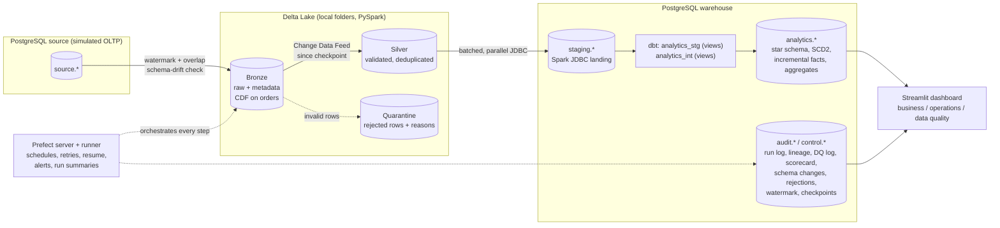

# Architecture and design decisions

## Overview

Every step is a script in [`src/`](../src) that runs on its own or as a Prefect task (each in its own process, so each Spark job gets a clean JVM). Every step is idempotent, so any step can be retried or rerun.

## Layers

| Layer | Storage | Written by | Contents |
|---|---|---|---|
| Source | Postgres `source` | `load_source.py`, `simulate_changes.py` | The operational system: orders, customers, items, payments, products, sellers |
| Bronze | Delta `lake/bronze/<table>` | [`extract_bronze.py`](../src/extract_bronze.py) | Raw rows with `ingestion_ts`, `batch_id`, `source_system`, `pipeline_run_id`, `source_table`. `orders` is incremental (watermark + 10-minute overlap, insert-if-not-exists MERGE on `(order_id, updated_at)`); the others are full snapshots |
| Silver | Delta `lake/silver/<table>` | [`transform_silver.py`](../src/transform_silver.py) | Trimmed, validated (named rules), latest valid version per key. `orders` is incremental from Bronze CDF. Rejected rows go to `lake/silver/_quarantine/<table>` with the rules they failed |
| Staging | Postgres `staging` | [`load_warehouse.py`](../src/load_warehouse.py) | Silver loaded with Spark JDBC (truncate and reload, row count verified) |
| dbt staging / intermediate | `analytics_stg`, `analytics_int` (views) | dbt | Renaming; order items enriched with order attributes |
| Gold | `analytics` | dbt | `fact_orders`, `fact_payments` (incremental), `dim_customer` (SCD2), `dim_product`, `dim_seller`, `dim_date`; aggregates `agg_daily_sales`, `agg_category_revenue`, `agg_monthly_kpis`, `agg_customer_retention`, `agg_product_sales` |
| Audit / control | `audit`, `control` | All steps | See below |

## Audit, lineage and control tables

| Table / view | Purpose |
|---|---|
| `audit.pipeline_run_log` | One row per flow run, task attempt and table load: run id, task, batch id, start/end, duration, source rows, inserted, updated, rejected, status, retry count, error |
| `audit.lineage` | Source → target per batch, with row count and the Delta version written (usable for time travel) |
| `audit.dq_log` | Every data quality result (pipeline checks and dbt tests), with category and source |
| `audit.dq_latest`, `audit.dq_scorecard`, `audit.dq_scorecard_by_category` | Data quality scorecard per run, overall and by category |
| `audit.schema_changes` | Every detected schema change and the action taken (evolved / cast / filled_null / rejected) |
| `audit.rejected_records` | Rows rejected by Silver validation, per run, table and rule, with sample keys |
| `audit.v_flow_runs`, `audit.v_task_stats` | Execution history: one row per run; per-task success rate and median/p95 duration |
| `audit.benchmark_results` | Measured performance results ([performance.md](performance.md)) |
| `audit.schema_migrations` | Applied migrations ([`sql/migrations`](../sql/migrations)) |
| `control.watermark` | Extract watermark (moves forward only) |
| `control.silver_checkpoint` | Last Bronze version merged into Silver |
| `control.checkpoint_history` | Every watermark/checkpoint change, written by a trigger, with the run that made it |

## Orchestration

| Deployment | When | What |
|---|---|---|
| `ecommerce-daily/daily` | Daily 02:00 (`DAILY_CRON`) or on demand | extract → silver → staging → dbt → checks. `start_from`/`stop_after` run part of it; `resume_failed` continues the latest failed run |
| `ecommerce-backfill/backfill` | On demand | Re-extract a date range in chunks, then rebuild downstream; the watermark is not touched |
| `ecommerce-lake-maintenance/weekly` | Sunday 03:00 (`MAINTENANCE_CRON`) | OPTIMIZE tables with many small files; VACUUM dry run (`vacuum=true` deletes) |
| `ecommerce-setup/run` | First run | Generate or load the source data and run the pipeline |
| `ecommerce-export-showcase/run` | On demand | Export the dashboard datasets to `docs/sample_output` |
| `ecommerce-delta-inspect/run` | On demand | Delta history, time travel and Change Data Feed (read-only) |
| Demos | On demand | `simulate-changes`, `bronze-health`, `simulate-bronze-loss`, `skew-demo` |

The runner executes one flow run at a time (`limit=1`). Tasks retry 3 times with backoff (quality checks don't retry). Failed, crashed and cancelled runs post an alert naming the failed step. Migrations run at the start of each flow.

## Design decisions

| Decision | Why | Trade-off |
|---|---|---|
| Watermark with an overlap window + insert-if-not-exists MERGE in Bronze | Cheap incremental reads; late-committed rows are not missed; reruns never duplicate | Rows changed without updating `updated_at`, and deletes, are not seen (real fix: CDC, e.g. Debezium) |
| Schema-drift check before every Bronze write | Delta MERGE silently drops new columns; a type change would fail deep inside a write | Removed columns and type changes stop the table until someone decides (`SCHEMA_DRIFT_ALLOW_REMOVED_COLUMNS` for removals) |
| Validate before deduplicating; quarantine with rule names | A bad newer version never hides the last good one; every rejected row says why | Silver can be behind the source for a key whose newest version is invalid (reported as `superseded_by_invalid` and by reconciliation) |
| Silver orders read from Bronze Change Data Feed with a checkpoint | Only changed rows are processed; nothing new means no rewrite | Needs CDF retention to cover the time between runs; otherwise it falls back to a full pass automatically |
| dbt staging/intermediate layers as views | Marts read clean, renamed data; no extra storage | Views are recomputed on every read (cheap at this size) |
| Incremental facts (delete+insert) with an anti-join for new keys | Only changed rows are rebuilt; late-arriving rows (e.g. from a backfill with an old `updated_at`) are still picked up | Source deletes are not propagated to the facts |
| SCD2 via dbt snapshot + point-in-time join | Reports show the customer's attributes at the time of the order | Snapshot granularity is one version per pipeline run |
| Audit writes are best effort | Observability must never fail the pipeline | If Postgres is down, that attempt's audit row is missing (the task still fails and retries) |
| Database triggers for checkpoint history | No code path can change a checkpoint without leaving a record | Logic in the database, not only in Python |
| Each Prefect task runs a script in a subprocess | Clean JVM per Spark job; scripts runnable without Prefect | About 30–40 s of Spark/Delta start-up per step |
| One Docker image for Prefect server and runner; code baked in, bind-mounted in development | One build; what was tested is what runs in production | The image is large (Java + Spark + dbt) |

## Scaling path

| Today | At larger scale |
|---|---|
| Spark `local[2]` in a container | Databricks / EMR / Spark on Kubernetes; same code, `SPARK_MASTER` and storage paths change |
| Delta on local folders | Delta on S3 / ADLS / GCS; partition large tables (e.g. orders by purchase month) |
| Postgres warehouse | Snowflake / BigQuery / Redshift (dbt adapters); the incremental models stay |
| Prefect `serve` runner | Prefect work pool with Docker / Kubernetes workers; the flows stay |
| Watermark extraction | Change data capture (Debezium / logical replication) to capture deletes and every change |
| Prefect server on SQLite | Prefect server on Postgres, or Prefect Cloud |
